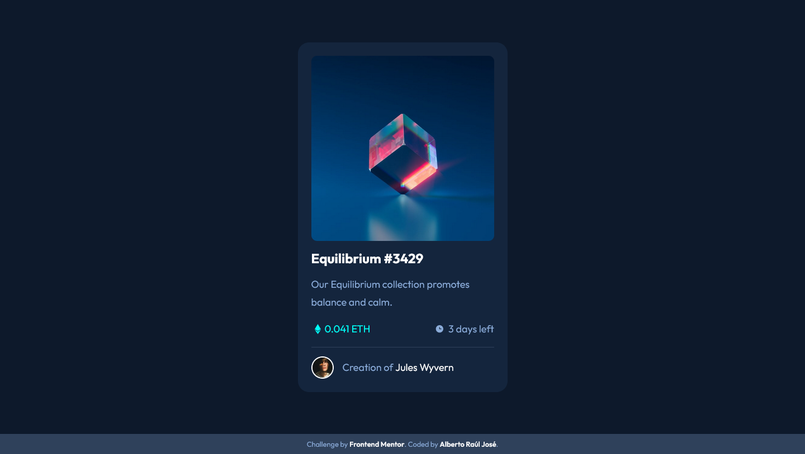

# Frontend Mentor - NFT preview card component solution

This is a solution to the [NFT preview card component challenge on Frontend Mentor](https://www.frontendmentor.io/challenges/nft-preview-card-component-SbdUL_w0U). Frontend Mentor challenges help you improve your coding skills by building realistic projects.

## Table of contents

- [Overview](#overview)
  - [The challenge](#the-challenge)
  - [Screenshot](#screenshot)
  - [Links](#links)
- [My process](#my-process)
  - [Built with](#built-with)
- [Author](#author)
- [Acknowledgments](#acknowledgments)

## Overview

### The challenge

Users should be able to:

- View the optimal layout depending on their device's screen size
- See hover states for interactive elements

### Screenshot

### Links

- Solution URL: [Solution URL](https://github.com/albertorauljose/desafios-do-frontendmentor/tree/main/nft-preview-card-component)
- Live Site URL: [Live site URL](https://albertorauljose.github.io/desafios-do-frontendmentor/nft-preview-card-component/index.html)

## My process

### Built with

- Semantic HTML5 markup
- Flexbox
- Mobile-first workflow

## Author

- Frontend Mentor - [@Alberto-RJ](https://www.frontendmentor.io/profile/Alberto-RJ)

- Twitter - [@albertorauljose](https://www.twitter.com/albertorauljose)

- Linkdin - [albertorauljose](https://www.linkdin.com/in/albertorauljose)

## Acknowledgments

 I especially thank the entire [Frontend Mentor] team and all the other [members of the platform], for giving me the great opportunity to put what I'm learning into practice. I'm fascinated by the challenges and I'm having a great experience with you here on the platform. A BIG THANK YOU, everyone!
