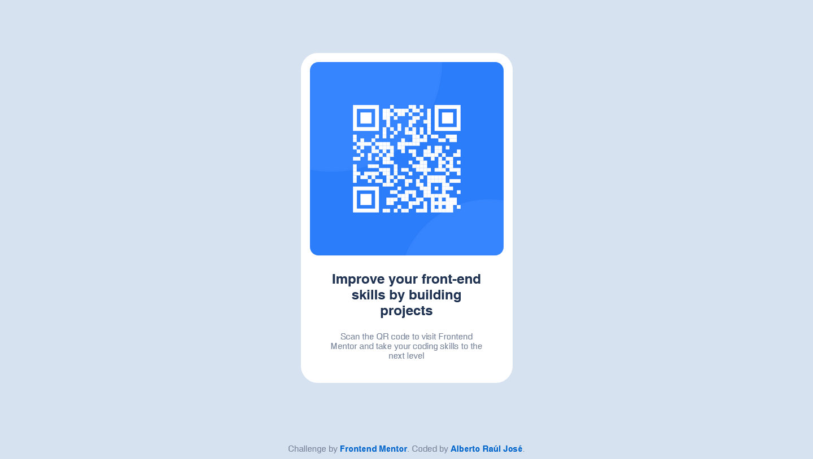

# Frontend Mentor - QR code component solution

This is a solution to the [QR code component challenge on Frontend Mentor](https://www.frontendmentor.io/challenges/qr-code-component-iux_sIO_H). Frontend Mentor challenges help you improve your coding skills by building realistic projects.

## Table of contents

- [Overview](#overview)
  - [Screenshot](#screenshot)
  - [Links](#links)
- [My process](#my-process)
  - [Built with](#built-with)
- [Author](#author)
- [Acknowledgments](#acknowledgments)

## Overview

### Screenshot

### Links

- Solution URL: [Solution URL](https://github.com/albertorauljose/desafios-do-frontendmentor/tree/main/qr-code-component)
- Live Site URL: [Live site URL](https://albertorauljose.github.io/desafios-do-frontendmentor/qr-code-component/index.html)

## My process

### Built with

- Semantic HTML5 markup
- Flexbox
- Mobile-first workflow

## Author

- Frontend Mentor - [@Alberto-RJ](https://www.frontendmentor.io/profile/Alberto-RJ)

- Twitter - [@albertorauljose](https://www.twitter.com/albertorauljose)

- Linkdin - [albertorauljose](https://www.linkdin.com/in/albertorauljose)

## Acknowledgments

 I especially thank the entire <strong>Frontend Mentor</strong> team and all the other <strong>members of the platform</strong>, for giving me the great opportunity to put what I'm learning into practice. I'm fascinated by the challenges and I'm having a great experience with you here on the platform. A BIG THANK YOU, everyone!
