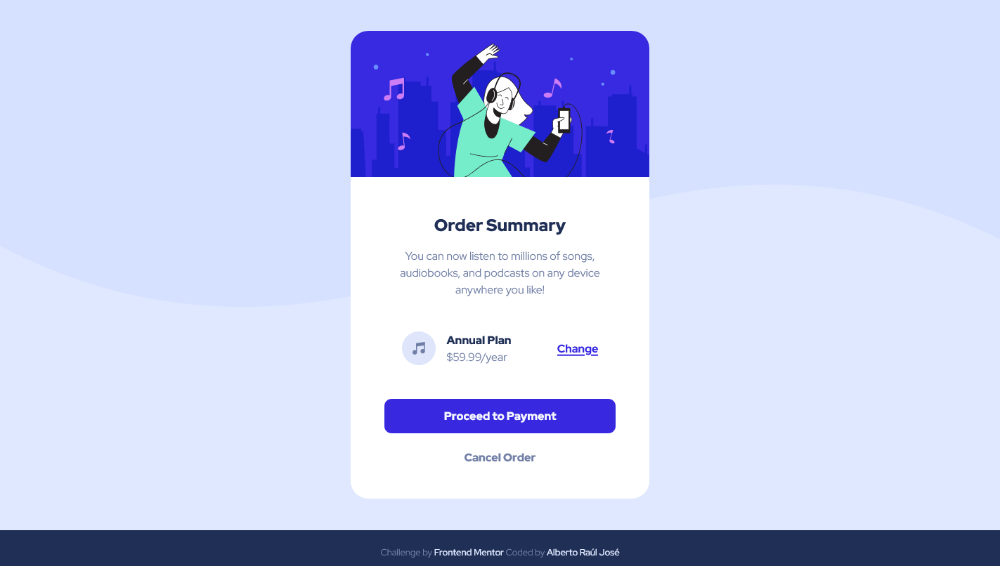

# Frontend Mentor - Order summary card solution

This is a solution to the [Order summary card challenge on Frontend Mentor](https://www.frontendmentor.io/challenges/order-summary-component-QlPmajDUj). Frontend Mentor challenges help you improve your coding skills by building realistic projects.

## Table of contents

- [Overview](#overview)
  - [The challenge](#the-challenge)
  - [Screenshot](#screenshot)
  - [Links](#links)
- [My process](#my-process)
  - [Built with](#built-with)
  - [What I learned](#what-i-learned)
  - [Continued development](#continued-development)
- [Author](#author)
- [Acknowledgments](#acknowledgments)

## Overview

### The challenge

Users should be able to:

- See hover states for interactive elements

### Screenshot

### Links

- Solution URL: [URL da solução](https://github.com/albertorauljose/desafios-do-frontendmentor/tree/main/order-summary-component)
- Live Site URL: [URL do site da solução](https://albertorauljose.github.io/desafios-do-frontendmentor/order-summary-component/index.html)

## My process

### Built with

- Semantic HTML5 markup
- Flexbox
- Mobile-first workflow

### What I learned

- CSS RESET - How important it is to use CSS RESET in a project.

- CSS Flexbox - Put CSS Flexbox concepts into practice.

### Continued development

In the future I would like to learn how to work better with CSS Media Queries and CSS Grid.

## Author

- Frontend Mentor - [@Alberto-RJ](https://www.frontendmentor.io/profile/Alberto-RJ)

- Twitter - [@albertorauljose](https://www.twitter.com/albertorauljose)

- Linkdin - [albertorauljose](https://www.linkdin.com/in/albertorauljose)

## Acknowledgments

 I especially thank the entire <strong>Frontend Mentor</strong> team and all the other <strong>members of the platform</strong>, for giving me the great opportunity to put what I'm learning into practice. I'm fascinated by the challenges and I'm having a great experience with you here on the platform. A BIG THANK YOU, everyone!